# iDrone: Control a drone with your hand

**Watch it fly:** [Instagram](https://www.instagram.com/p/DX7eG0mR4I6/?hl=en) (2.6M+ views), [TikTok](https://www.tiktok.com/@pattssun/video/7636158433917488398) (1.3M+ views)

A MacBook watches my right hand through the webcam. When I open my hand with fingers pointing up, the drone climbs. Fingers down, it descends. Fist, it hovers. Under the hood, a Raspberry Pi Pico W is hot-wired into a Holy Stone HS210 remote, feeding voltage straight into the throttle stick's wiper pad like a robot thumb.

https://github.com/user-attachments/assets/2e865f00-9945-4dc8-86bc-12b2fac63e3d

> [!TIP]
> **Stuck on any step? Drop this repo into [Claude Code](https://claude.ai/code) (or any AI coding agent) and ask away.** It can answer questions about the wiring, debug your code, walk you through anything below, and even help you adapt the build for a different drone. That's how I built it.

## I had zero hardware/electronics background when I built this

I'd never soldered before. I didn't know what a DAC was. I broke a thing or two figuring it out, and I'm writing every gotcha down so you don't have to. If you can follow LEGO instructions and you're willing to touch a soldering iron twice, you can build this.

Parts (the stuff that stays in the build) ran me **~$96**. Tools, if you don't already own a soldering iron, multimeter, and screwdrivers, add another **~$104**. Full breakdown below.

## Contents

- [How a flight goes](#how-a-flight-goes)
- [Bill of materials](#bill-of-materials)
- [The build](#the-build)
- [The code](#the-code)
- [Things I learned](#things-i-learned-the-hard-way)
- [What it doesn't do (read before you build)](#what-it-doesnt-do-read-before-you-build)
- [What's next](#whats-next)

## How a flight goes

This is the exact sequence from the video:

1. Drone in my left hand, remote also in my left hand.
2. Left thumb presses the physical takeoff button, and the drone takes off.
3. Right hand in front of the webcam, fist → drone hovers.
4. Right hand opens, fingers up → drone climbs.
5. Fist again → hovers.
6. Right hand opens, fingers down → drone descends and lands.

---

## Bill of materials

### Parts (stay in the build)

| Item | Price |
|------|------:|
| [Holy Stone HS210 mini drone](https://www.amazon.com/gp/product/B07PBD6J2W) | $39.99 |
| [Raspberry Pi Pico 2 WH + Micro USB](https://www.amazon.com/Pico-WH-Basic-Kit-Microcontroller/dp/B0F4W9J5CC) | $14.99 |
| [MCP4728 DAC breakout](https://www.adafruit.com/product/4470) | $7.50 |
| [Male/female header pins](https://www.amazon.com/2-54mm-Breakaway-Female-Connector-Arduino/dp/B01MQ48T2V) | $7.49 |
| [Breadboard + jumper wires](https://www.amazon.com/REXQualis-Electronics-tie-Points-Breadboard-Potentiometer/dp/B073ZC68QG) | $15.77 |
| [28 AWG hookup wire (2 colors)](https://www.amazon.com/Fermerry-Silicone-Colors-Flexible-Electrical/dp/B089CWGQKW) | $10.09 |
| **Parts subtotal** | **$95.83** |

The DAC ("digital-to-analog converter") is the chip that turns numbers into voltage. We only need channel A of its four. I²C address `0x60`. You also need a MacBook (or any Mac/PC running Python) with a webcam, assumed not included.

### Tools (one-time, skip if you have them)

| Item | Price |
|------|------:|
| [Soldering iron kit](https://www.amazon.com/Soldering-Interchangeable-Adjustable-Temperature-Enthusiast/dp/B087767KNW) | $13.99 |
| [Soldering practice kit](https://www.amazon.com/Gikfun-Welding-Practice-Soldering-Training/dp/B00VWB8F8K) | $8.88 |
| [Flux pen + desoldering wick](https://www.amazon.com/Lesnow-Desoldering-Electronics-Disassemble-Electrical/dp/B0F8BJPC9Y) | $9.99 |
| [Wire strippers](https://www.amazon.com/DOWELL-Stripper-Multi-Function-Tool%EF%BC%8CProfessional-Craftsmanship/dp/B07D25N45F) | $6.99 |
| [Digital multimeter](https://www.amazon.com/AstroAI-Multimeter-Resistance-Transistors-Temperature/dp/B071JL6LLL) | $26.95 |
| [Precision screwdriver set](https://www.amazon.com/gp/product/B08SGM6F79) | $25.19 |
| [Helping hands](https://www.amazon.com/Neiko-01902-Adjustable-Magnifying-Alligator/dp/B000P42O3C) | $11.99 |
| **Tools subtotal** | **$103.98** |

If you've never soldered before, the practice kit is the cheapest insurance you'll ever buy. Do it before you touch the drone remote.

---

## The build

### Step 1: Open the HS210 remote

Four Phillips screws on the back of the transmitter. Lift the PCB out carefully. The antenna wire is short and you can tear it if you yank.

### Step 2: Find the right pads

We need two pads on the PCB:

- **L2**: the wiper pad of the left joystick's throttle axis. ("Wiper" is the middle terminal of a potentiometer, the one whose voltage changes as the stick moves.)
- **B−**: board ground, on the edge of the PCB near the battery contacts.

> [!WARNING]
> **The PCB mirrors left/right when you flip it over.** Looking at the back of the board (the side you'll solder on), the "left" joystick is on your right. I labeled my first pad wrong because of this. Verify before you reach for the iron.

- **Continuity:** multimeter in continuity mode, one probe on `B−`, the other on the battery negative terminal. Should beep.
- **Voltage swing:** multimeter in DC voltage mode, black probe on ground, red on `L2`. Wiggle the throttle stick. The voltage should swing. That's your pad.

### Step 3: Solder two wires

- Blue wire → `L2` (throttle signal in)
- White wire → `B−` (shared ground)

That's the entire PCB hack. **Do not remove the joysticks. Do not cut any wiper tabs.** The joysticks need to stay electrically intact (more on why in [Things I learned](#things-i-learned-the-hard-way)). Reassemble the remote.

### Step 4: Wire up the Pico and DAC

On the breadboard:

**I²C bus** (I²C is the two-wire chat protocol the Pico uses to talk to the DAC):
- Pico `GP4` → DAC `SDA`
- Pico `GP5` → DAC `SCL`

**Power:**
- Pico `3V3` → DAC `VIN`
- Pico `GND` → DAC `GND`

**Signal out to the remote:**
- DAC channel `A` output → blue wire (the one soldered to `L2`)
- Pico `GND` → white wire (the one soldered to `B−`). Shared ground between the Pico and the remote is non-negotiable.

DAC I²C address: `0x60`.

### Step 5: The schematic, end to end



### Step 6: Flash MicroPython on the Pico

1. Download the MicroPython UF2 file for your Pico: [Pico 2 W](https://micropython.org/download/RPI_PICO2_W/) (matches the BOM) or [Pico W](https://micropython.org/download/RPI_PICO_W/) if that's what you have.
2. Hold the `BOOTSEL` button on the Pico, plug it into your Mac. A USB drive appears.
3. Drag the UF2 onto that drive. The Pico reboots and the drive disappears. Firmware is on.

### Step 7: Upload the Pico firmware

> [!WARNING]
> **Do not use the MicroPico VSCode plugin.** It sends Ctrl+C to the Pico every time it connects, which kills the running script. I lost hours to this. Use `mpremote` from the command line instead.

```bash
pip install mpremote
mpremote cp pico/pico_dac_controller.py :main.py
mpremote reset
```

Now the Pico runs the DAC controller on every power-up.

### Step 8: Set up the Mac

Tested on **Python 3.11**. MediaPipe is finicky on 3.13, so stick to 3.10–3.12 if you can.

```bash
python -m venv venv
source venv/bin/activate
pip install -r requirements.txt
```

The MediaPipe hand-tracking model is already in the repo at `models/hand_landmarker.task`.

### Step 9: Verify hand tracking (no hardware needed)

```bash
python hand_throttle.py --no-serial
```

A webcam window opens. Hold up your right hand. You should see neon ray beams shooting out from each fingertip:

- All fingers pointing up → rays glow **green** (climb)
- All fingers pointing down → rays glow **red** (descend)
- Fist or mixed → rays glow **gray** (hover)

### Step 10: Verify the DAC actually outputs voltage (no drone needed)

Close VSCode or anything else that might be holding the Pico's serial port. Only one program can talk to the Pico at a time. Plug the Pico in. Then run:

```bash
python hand_throttle.py
```

Probe the blue wire (where it meets `L2`, or before you reassemble) with the multimeter in DC voltage mode:

- Fist → ~1.65 V (DAC value 2048, hover)
- Fingers up → ~3.3 V (DAC value 4095, climb)
- Fingers down → ~0 V (DAC value 0, descend)

The voltage should glide between states rather than snap. That's the EMA smoothing (~300 ms ramp).

### Step 11: Bind the drone

Standard HS210 bind procedure: power on the remote, power on the drone, push the throttle stick all the way up then all the way down. This works because the joysticks are still electrically intact. The drone's chip needs the physical pots to complete the bind handshake.

### Step 12: First flight

Pick an indoor, open space with a soft floor. Then:

1. Hold the drone and remote together in your left hand.
2. Right hand in front of the webcam, **start as a fist** (hover).
3. Left thumb presses the takeoff button on the remote.
4. Open your right hand with fingers up → drone climbs.
5. Fist → hover.
6. Open with fingers down → drone descends.

---

## The code

Two files do the real work.

### `hand_throttle.py` (Mac side)

- Pulls webcam frames with OpenCV and runs MediaPipe's `hand_landmarker.task` model on each one (right hand only, left hand is ignored).
- For each of the four main fingers (index, middle, ring, pinky), draws a vector from the base joint to the fingertip and measures the angle from vertical. The thumb is excluded from the up/down decision because it points sideways even on a relaxed open hand.
- Decision rule:
  - All four fingers within 45° of pointing up → throttle = 4095 (climb)
  - All four within 45° of pointing down → throttle = 0 (descend)
  - Any disagreement, a fist (openness < 1.3), or no hand → throttle = 2048 (hover)
- EMA smoothing with alpha 0.3 (~300 ms ramp) so the throttle glides rather than snaps.
- Streams `throttle,yaw,pitch,roll\n` over USB serial at 115200 baud to the Pico.
- On-screen: neon ray beams from each fingertip in the direction the finger is pointing, pulsing at 2 Hz, colored green / red / gray.
- Flags:
  - `--no-serial`: visuals only, no Pico needed (for verifying the camera and tracking).
  - `--no-joystick`: run without a gamepad. Yaw/pitch/roll fall back to keyboard (A/D for yaw, arrow keys for pitch/roll).

### `pico/pico_dac_controller.py` (Pico side, MicroPython)

- Reads `throttle,yaw,pitch,roll` lines over USB serial at 115200 baud.
- Writes the throttle value to MCP4728 channel A over I²C (address `0x60`, SDA on GP4, SCL on GP5).
- **500 ms watchdog:** if no fresh packet arrives within 500 ms, all channels snap to 2048 (hover). If the Mac stalls or the USB cable wiggles, the drone goes neutral within half a second instead of doing something unpredictable.
- Channels B/C/D are written too but the drone hack only listens to A right now. They're there for the four-axis future build.

### `pico/mac_dac_sender.py` (optional debug tool)

Standalone keyboard-controlled DAC sender. Not part of the build flow. Useful only if you want to manually drive throttle/yaw/pitch/roll from the keyboard to test the Pico and DAC wiring before introducing hand tracking. You don't need this to fly.

---

## Things I learned (the hard way)

1. **The PCB mirrors left/right when flipped.** Solder pad identity is not where your intuition says it is. Multimeter it before you solder.
2. **The drone's chip pulses ADC reads through the joystick wipers.** ("ADC" is the chip's analog-to-digital converter, how it reads stick position.) If you probe a wiper and see weird ~290–366 mV jitter, that's the sampling pattern, not a broken board. Don't chase it.
3. **Binding needs the physical pots.** Pull the joysticks out, or cut both tabs and try to feed the DAC straight in, and binding will silently fail. Leave the sticks alone. The DAC overrides the pot during flight because it's a stiffer voltage source.
4. **The MicroPico VSCode plugin will kill your firmware on connect.** It sends Ctrl+C. Use `mpremote`.
5. **The Pico's serial port is single-owner.** If VSCode, MicroPico, Thonny, or anything else has it open, `hand_throttle.py` won't be able to connect. Close everything else.
6. **The 500 ms Pico watchdog is load-bearing.** It's what makes this safe to fly. Keep it in the firmware.

---

## What it doesn't do (read before you build)

Setting expectations honestly so nobody's surprised:

- **Throttle only.** Your hand controls altitude. Pitch, roll, and yaw still live on the physical joysticks of the remote. You can't fly the drone around a room hands-free.
- **Hover drifts.** With pitch and roll on a stationary stick and no closed-loop position control, the drone will wander. The viral clip is short for a reason.
- **Indoors only, practically.** Outside, wind makes the drift unmanageable.
- **It's a toy drone.** The HS210 is twitchy by nature. This isn't a precision aircraft and it's not pretending to be.

---

## What's next

Four-axis gesture control is the obvious next move: pitch, roll, and yaw all on the hand. I'm also putting together a video on the AI-assisted method I used to teach myself enough electronics to get this built. More coming.

---

**If you build this, tag [@pattssun](https://www.instagram.com/pattssun/) on Instagram or TikTok. I want to see it fly.** ⭐ the repo to follow the four-axis build.

[MIT](LICENSE) license.
